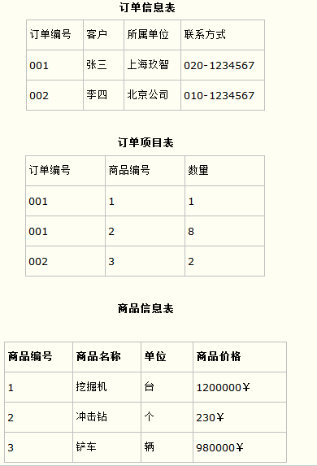

# mysql基础

## 1. 库操作：

中括号代表可省略，name为自定义名称。

```mysql
SHOW DATABASES;
CREATE DATABASE name;
DROP DATABASE name;
USE DATABASE name; //DATABASE可省略
```


## 2. 表操作：既DDL(Data Definition Language)

### 2.1 查看表：
```mysql
SHOW TABLES;//查看当前库下所有表
DESC table_name; //查看表结构
SHOW CREATE TABLE table_name;//查看建表语句
```


### 2.2 创建表：

备注：table_name、column_name、column_type为自定义名称。

```mysql
CREATE TABLE table_name (column_name column_type,column_name column_type...,CONSTRAINT...);//创建table_name表
```

#### 2.2.1 数据类型:
字符型：

```
类型            最大字符长度         名称及特性
char            255                定长字符串，区分大小写
varchar         65535              变长字符串，区分大小写
binary          255                二进制定长字符串，区分大小写
varbinary       65535              二进制变长字符串，区分大小写

tinytext        255                text类型是文本大对象存储，就是说它存储的并不是数据本身，而是一个指针，指向数据的存储所在位置；text不区分大小写
text            65535
mediumtext      16777215
longtext        4294967295

tinyblob        255                blob类型是二进制大对象存储，它是text的二进制形式，区分大小写
blob            65535
mediumblob      16777215
longblob        4294967295
```
数值型：

```
类型            名称              取值范围(有符号,无符号)
TINYINT         最小整数　　　　　　-128到127，0到255
SMALLINT        小整数            -32768到32767，0到65535
MEDIUMINT       中整数            -8388607到8388607，0到16777215
INT             整数　　　　　　　　-2147483647到2147483647，0到4294967295
BIGINT          大整数            -9223372036854775807到9223372036854775807，0到18446744073709551615
decimal         十进制            
FLOAT           单精度浮点
DOUBAL          双精度浮点
```
日期及时间型：

```
类型                名称                取值范围
DATE                日期                '1000-01-01'到'9999-12-31'
TIME                时间                '-838:59:59'到'838:59:59'
DATETIME            日期时间             '1000-01-01 00:00:00'到'9999-12-31 23:59:59'
TIMESTAMP           时间戳　　　　　　　　 '1970-01-01 00:00:00'到’2037年某时'
YEAR                年                  4位格式：1901到2155，2位格式：1970-2069(70-69)，或：0000 
```
自有类型：

```
SET：字符串集合，事先给出多个元素(最多64个)供用户选择，用户可以选多个元素填入
ENUM：枚举，事先给出多个元素(最多65536个)供用户选择，用户只能选一个元素填入
```

#### 2.2.2 约束：

| 关键字         | 意义       | 建表时可以随列名后加 | 建表时可以最后加 |
| -------------- | ---------- | -------------------- | ---------------- |
| AUTO_INCREMENT | 自增约束   | 可                   |                  |
| NOT NULL       | 非空约束   | 可                   |                  |
| DEFAULT        | 默认值约束 | 可                   |                  |
| UNIQUE         | 唯一约束   | 可                   | 可               |
| PRIMARY KEY    | 主键约束   | 可                   | 可               |
| FOREIGN KEY    | 外键约束   |                      | 可               |

**AUTO_INCREMENT、NOT NULL用法**
	加到colume_name之后。如colume_name AUTO_INCREMENT。
	注意！！AUTO_INCREMENT的列，必须定义PRIMARY KEY或UNIQUE，且一个表只能有一个AUTO_INCREMENT。
	**重置序列：**
	如果你删除了数据表中的多条记录，并希望对剩下数据的AUTO_INCREMENT列进行重新排列，那么你可以通过删除自增的列，然后重新添加来实现。 不过该操作要非常小心，如果在删除的同时又有新记录添加，有可能会出现数据混乱。操作如下所示：

```mysql
mysql> ALTER TABLE insect DROP id;
mysql> ALTER TABLE insect
    -> ADD id INT UNSIGNED NOT NULL AUTO_INCREMENT FIRST,
    -> ADD PRIMARY KEY (id);
```

​	**设置序列的开始值:**
​	一般情况下序列的开始值为1，但如果你需要指定一个开始值100，那我们可以通过以下语句来实现：

```mysql
mysql> CREATE TABLE insect
    -> (
    -> id INT UNSIGNED NOT NULL AUTO_INCREMENT,
    -> PRIMARY KEY (id),
    -> name VARCHAR(30) NOT NULL, 
    -> date DATE NOT NULL,
    -> origin VARCHAR(30) NOT NULL
)engine=innodb auto_increment=100 charset=utf8;
//也可以在表创建成功后，通过以下语句实现
mysql> ALTER TABLE t AUTO_INCREMENT = 100;

```

**DEFAULT 用法**
​	加到colume_name之后。如colume_name DEFAULT ‘lss’。

**UNIQUE 用法**
​	加到colume_name之后。如colume_name UNIQUE。
​	或者加到CONSTRAINT之后。如CONSTRAINT colume_name UNIQUE。

UNIQUE到底是约束还是索引？
1. 两者关系
	unique索引包含了unique约束，因为unique约束是通过unique索引实现的. 
为了实现唯一约束,数据库会强制定义一个唯一索引在数据库上面
2. 两者相同点
	保证了往表中插入重复列值的操作都会失败。
3. 两者的区别
	区别在于建立和删除上.索引是使用 create/drop index 创建和删除的而约束是使用 alter table tb add constraint 建立, 使用 drop constraint 删除

**PRIMARY KEY 用法**
​	加到CONSTRAINT之后。如CONSTRAINT PRIMARY KEY (colume_name) 。
​	注意！！加了该约束，将同时具有NOT NULL与UNIQUE性质。

**FOREIGN KEY 用法**
​	加到CONSTRAINT之后。如CONSTRAINT FOREIGN KEY (colume_name) REFERENCES table_name(unique_key)。
​	注意：关联的外键时必须满足:

1. colume_name不能为本表主键

2. unique_key必须是另一表的主键或唯一索引(unique约束)

3. 两个键必须有相同的数据类型

	现在由于性能问题，很少用物理外键，大都改用给逻辑外键。​	

**例子**

```mysql
DROP TABLE IF EXISTS `artical`;
CREATE TABLE IF NOT EXISTS `artical`(
	`id` INT UNSIGNED AUTO_INCREMENT,
	`artical` VARCHAR(255),
	PRIMARY KEY ( `id` )
)ENGINE=InnoDB DEFAULT CHARSET=utf8 AUTO_INCREMENT=1;
```

```mysql
DROP TABLE IF EXISTS `blog`;
CREATE TABLE IF NOT EXISTS `blog`(
	`id` INT UNSIGNED AUTO_INCREMENT,
    `uuid` CHAR(32) UNIQUE,
	`title` VARCHAR(100) NOT NULL,
	`author` VARCHAR(40) NOT NULL,
	`submission_date` DATETIME DEFAULT NOW(),
	`able` ENUM('Y','F') DEFAULT 'Y',
	`tag` SET('life','tech','note'),
	`artical_id` INT UNSIGNED,
	PRIMARY KEY ( `id` ),
	CONSTRAINT f_key FOREIGN KEY (`artical_id`) REFERENCES artical(`id`)
)ENGINE=InnoDB DEFAULT CHARSET=utf8 AUTO_NCREMENT=1;
```

### 2.3 删除表：
```mysql
DROP TABLE table_name;//删除table_name表
TRUNCATE TABLE table_name; //只删除数据，不删除表本身结构
```
### 2.4 修改表结构：

```mysql
ALTER TABLE table_name ADD COLUMN column_name datatype;
ALTER TABLE table_name DROP COLUMN column_name;
ALTER TABLE table_name ADD CONSTRAINT UNIQUE index_name(column_name); //添加约束，主键、外键约束也同理。CONSTRAINT可以省略，但只能加UNIQUE和主键
//ALTER COLUMN 用于默认值的设置和清除。
ALTER TABLE Persons ALTER COLUMN City SET DEFAULT 'SANDNES';
ALTER TABLE Persons ALTER COLUMN City DROP DEFAULT;
//CHANGE COLUMN 字段重命名，改变数据类型，移动位置。
ALTER TABLE MyTable CHANGE COLUMN foo bar VARCHAR(32) NOT NULL FIRST;//FIRST表示增加此列为第一个列
ALTER TABLE MyTable CHANGE COLUMN foo bar VARCHAR(32) NOT NULL AFTER baz;//AFTER表示增加在某个列之后
//MODIFY 可以做CHANGE所有事，除了重命名字段
ALTER TABLE table_name MODIFY COLUMN column_name datatype;
```

### 2.5 如何设计表:

​	见[附录A](###A. 数据库设计三大范式)

### 2.6* 删除重复数据
​	如果你想删除数据表中的重复数据，你可以使用以下的SQL语句：

```mysql
mysql> CREATE TABLE tmp SELECT last_name, first_name, sex FROM person_tbl  GROUP BY last_name, first_name, sex;
mysql> DROP TABLE person_tbl;
mysql> ALTER TABLE tmp RENAME TO person_tbl;
```

​	当然你也可以在数据表中添加 INDEX（索引） 和 PRIMAY KEY（主键）这种简单的方法来删除表中的重复记录。方法如下：**(Mysql 5.7后就不行了)**

```mysql
mysql> ALTER IGNORE TABLE person_tbl
    -> ADD PRIMARY KEY (last_name, first_name);
```


## 3.数据操作CRUD: 既DML(Data Manipulation Language)

### 3.1 增 INSERT

```mysql
INSERT INTO table_name (column_name1,column_name2,..) VALUES (value1,value2,value3,...),(...);
INSERT INTO table_name (column_name1,column_name2) SELECT ...;
INSERT IGNORE INTO ....//忽略插入错误，比如设置了UNIQUE索引并插入重复数据，则不会报错。
```

### 3.2 删 DELETE

```mysql
DELETE FROM table_name [WHERE ...]
//注意没有DELETE * FROM table_name
```

### 3.3 改 UPDATE

```mysql
UPDATE table_name SET field1=new-value1, field2=new-value2 WHERE field1=new-value1
```

### 3.4 查 SELECT 既DQL(Data Query Language)

#### 基本关键字：
​		SELECT column_name,column_name FROM table_name;

**distinct:**
​		SELECT DISTINCT column_name,column_name FROM table_name;

**where:**
​		SELECT column_name,column_name FROM table_name WHERE column_name operator value;

**and or:**
​		SELECT column_name,column_name FROM table_name WHERE column_name operator value AND/OR column_name operator value;

**between and:**
	select * frome t_student where age not between 21 and 29;

**in**:
 	select * from t_student where age not in (21,23);

**exists:**
若exists子查询查到一行则where子句为true，若未查到返回空列表则为false
select * from student where exists (select sc.sid from sc where student.sid = sc.sid);
注意：in和exists有效率区别，详见:https://www.cnblogs.com/emilyyoucan/p/7833769.html

**is null/is not null/ifnull(column_name,yourdefault): **（ NULL是不能用=和!=判断的）
	SELECT * FROM runoob_test_tbl WHERE runoob_count IS NULL;
	SELECT runoob_count1+ifnull(runoob_count,0)  FROM runoob_test_tbl;

**order by:**
​	SELECT column_name,column_name FROM table_name ORDER BY column_name,column_name ASC|DESC;

**limit:**
​		SELECT column_name FROM table_name LIMIT number;

**别名：**
​		SELECT column_name1 alias_name1,column_name2 alias_name2 FROM table_name;

多表：

**模糊查找like：**一般like放最后 有助于效率提升

```mysql
SELECT field1, field2,...fieldN 
FROM table_name
WHERE filed2 = 'somevalue' [AND [OR]] field1 LIKE condition1
```

通配符：
	通配符的分类:
		%百分号通配符: 表示任何字符出现任意次数 (可以是0次).
		_下划线通配符:表示只能匹配单个字符,不能多也不能少,就是一个字符.

三条注意：
​		注意大小写,在使用模糊匹配时,也就是匹配文本时,mysql是可能区分大小的,也可能是不区分大小写的,这个结果是取决于用户对MySQL的配置方式.如果是区分大小写,那么像YvesHe这样记录是不能被"yves__"这样的匹配条件匹配的.
​		注意尾部空格,"%yves"是不能匹配"heyves "这样的记录的.
​		注意NULL,%通配符可以匹配任意字符,但是不能匹配NULL,也就是说SELECT * FROM products WHERE products.prod_name like '%';是匹配不到products.prod_name为NULL的的记录.

技巧与建议:

​	正如所见， MySQL的通配符很有用。但这种功能是有代价的：通配符搜索的处理一般要比前面讨论的其他搜索所花时间更长。这里给出一些使用通配符要记住的技巧。
​	不要过度使用通配符。如果其他操作符能达到相同的目的，应该 使用其他操作符。
​	在确实需要使用通配符时，除非绝对有必要，否则不要把它们用 在搜索模式的开始处。把通配符置于搜索模式的开始处，搜索起来是最慢的。

**合并查找union:**

```mysql
SELECT expression1, expression2, ... expression_n
FROM tables
[WHERE conditions]
UNION [ALL | DISTINCT]
SELECT expression1, expression2, ... expression_n
FROM tables
[WHERE conditions];
```

**分组查找group by：**

注意必须包含group by得column_name

```sql
SELECT column_name, function(column_name)
FROM table_name
WHERE column_name operator value
GROUP BY column_name;
```

例子：

```mysql
select gradeName,group_concat(stuName) from t_student group by gradeName;
select gradeName,count(stuName) from t_student group by gradeName;
select gradeName,count(stuName) from t_student group by gradeName having count(stuName)>3;//只显示统计结果大于3得


```


使用 WITH ROLLUP：

WITH ROLLUP 可以实现在分组统计数据基础上再进行相同的统计（SUM,AVG,COUNT…）。
例如我们将以上的数据表按名字进行分组，再统计每个人登录的次数：

```mysql
mysql> SELECT name, SUM(singin) as singin_count FROM  employee_tbl GROUP BY name WITH ROLLUP;
+--------+--------------+
| name   | singin_count |
+--------+--------------+
| 小丽 |            2 |
| 小明 |            7 |
| 小王 |            7 |
| NULL   |           16 |
+--------+--------------+
4 rows in set (0.00 sec)
```

其中记录 NULL 表示所有人的登录次数。
我们可以使用 coalesce 来设置一个可以取代 NUll 的名称，coalesce 语法：

```mysql
mysql> SELECT coalesce(name, '总数'), SUM(singin) as singin_count FROM  employee_tbl GROUP BY name WITH ROLLUP;//select coalesce(a,b,c);如果a==null,则选择b；如果b==null,则选择c；如果a!=null,则选择a；如果a b c 都为null ，则返回为null（没意义）。
+--------------------------+--------------+
| coalesce(name, '总数') | singin_count |
+--------------------------+--------------+
| 小丽                   |            2 |
| 小明                   |            7 |
| 小王                   |            7 |
| 总数                   |           16 |
+--------------------------+--------------+
4 rows in set (0.01 sec)
```

#### 多表连接查询join：

【注意】：Oracle数据库支持full join，mysql是不支持full join的，但仍然可以同过左外连接+ union+右外连接实现


**内连接INNER JOIN:**

```mysql
SELECT a.runoob_id, a.runoob_author, b.runoob_count FROM runoob_tbl a INNER JOIN tcount_tbl b ON a.runoob_author = b.runoob_author;
//与下面等价
SELECT a.runoob_id, a.runoob_author, b.runoob_count FROM runoob_tbl a, tcount_tbl b WHERE a.runoob_author = b.runoob_author;
//如果不加where/on判断的话 将会是深度优先依次遍历所有写出的表 就没有什么连接关系了。
```

**左连接LEFT [OUTER] JOIN:**

必须带ON条件

```mysql
SELECT a.runoob_id, a.runoob_author, b.runoob_count FROM runoob_tbl a LEFT JOIN tcount_tbl b ON a.runoob_author = b.runoob_author;
```

使用了 LEFT JOIN，该语句会读取左边的数据表 runoob_tbl 的所有选取的字段数据，即便在右侧表 tcount_tbl中 没有对应的 runoob_author 字段值。

**右连接RIGHT [OUTER]  JOIN：**

必须带ON条件

```mysql
SELECT a.runoob_id, a.runoob_author, b.runoob_count FROM runoob_tbl a RIGHT JOIN tcount_tbl b ON a.runoob_author = b.runoob_author;
```

使用了 RIGHT JOIN，该语句会读取右边的数据表 tcount_tbl 的所有选取的字段数据，即便在左侧表 runoob_tbl 中没有对应的runoob_author 字段值。

**左右连接排除内连接：**

见上图最中间俩

**全连接：**

mysql不支持全连接，但是可以用union合并两个连接，如：

```mysql
//类似上图左下
select * from test_employee a left join artical b on a.id=b.id  union select * from test_employee a right join artical b on a.id=b.id;
//类似上图右下
select * from test_employee a left join artical b on a.id=b.id where b.id is null union select * from test_employee a right join artical b on a.id=b.id where a.id is null;
```

#### 正则表达式查询：

| 模式       | 描述                                                         |
| :--------- | :----------------------------------------------------------- |
| ^          | 匹配输入字符串的开始位置。如果设置了 RegExp 对象的 Multiline 属性，^ 也匹配 '\n' 或 '\r' 之后的位置。 |
| $          | 匹配输入字符串的结束位置。如果设置了RegExp 对象的 Multiline 属性，$ 也匹配 '\n' 或 '\r' 之前的位置。 |
| .          | 匹配除 "\n" 之外的任何单个字符。要匹配包括 '\n' 在内的任何字符，请使用象 '[.\n]' 的模式。 |
| [...]      | 字符集合。匹配所包含的任意一个字符。例如， '[abc]' 可以匹配 "plain" 中的 'a'。 |
| [^...]     | 负值字符集合。匹配未包含的任意字符。例如， '[^abc]' 可以匹配 "plain" 中的'p'。 |
| p1\|p2\|p3 | 匹配 p1 或 p2 或 p3。例如，'z\|food' 能匹配 "z" 或 "food"。'(z\|f)ood' 则匹配 "zood" 或 "food"。 |
| *          | 匹配前面的子表达式零次或多次。例如，zo* 能匹配 "z" 以及 "zoo"。* 等价于{0,}。 |
| +          | 匹配前面的子表达式一次或多次。例如，'zo+' 能匹配 "zo" 以及 "zoo"，但不能匹配 "z"。+ 等价于 {1,}。 |
| {n}        | n 是一个非负整数。匹配确定的 n 次。例如，'o{2}' 不能匹配 "Bob" 中的 'o'，但是能匹配 "food" 中的两个 o。 |
| {n,m}      | m 和 n 均为非负整数，其中n <= m。最少匹配 n 次且最多匹配 m 次。 |

### 3.5 SQL练习题

https://blog.csdn.net/weixin_37645838/article/details/83585505

附第九题答案：
```mysql
select * from student where sid in 
	(select sid from sc where sid not in
		(select sid from sc where cid not in (select cid from sc where sid='01'))
group by sid 
having count(*)=(select count(*) from sc where sid='01') and sid != '01');
```

### 3.6 导入/出数据

​	对于.sql文件的导入导出，navicat貌似有相关功能,不想去研究了。
​	这方面其实都不太想研究，等实际工作有需求再说。如果有同学有研究 ，求分享！

#### 3.6.1 导入excel:

​	其实用navicat也可以

**方法一:**


#### 3.6.2 导出excel：

​	其实用navicat也可以

**方法一：**

```mysql
mysql -hxx -uxx -pxx -e "query statement" db > file 
//其中query statement为搜索语句如"select * from `tablename`",db为数据库名
2.select * from table into outfile 'xxx.txt'; 
3.navicat导出
```

**方法二：**

```mysql
select * from user into outfile '/tmp/user.csv' fields terminated by ',' optionally enclosed by '"' lines terminated by '\r\n
```

参数说明：

| 参数                                | 意义                                 |
| ----------------------------------- | ------------------------------------ |
| into outfile ‘导出的目录和文件名’   | 指定导出的目录和文件名               |
| fields terminated by ‘字段间分隔符’ | 定义字段间的分隔符                   |
| optionally enclosed by ‘字段包围符’ | 定义包围字段的字符（数值型字段无效） |
| lines terminated by ‘行间分隔符’    | 定义每行的分隔符                     |
|                                     |                                      |

**注意！！可能会出现问题**

以上命令在mysql5.6下运行没有问题，但在mysql5.7下运行则出现错误 ERROR 1290 (HY000)。

查看官方文档，secure_file_priv参数用于限制LOAD DATA, SELECT …OUTFILE, LOAD_FILE()传到哪个指定目录。

- secure_file_priv 为 NULL 时，表示限制mysqld不允许导入或导出。
- secure_file_priv 为 /tmp 时，表示限制mysqld只能在/tmp目录中执行导入导出，其他目录不能执行。
- secure_file_priv 没有值时，表示不限制mysqld在任意目录的导入导出。

查看 **secure_file_priv** 的值，默认为NULL，表示限制不能导入导出。

```mysql
show global variables like '%secure_file_priv%';//查看**secure_file_priv** 
```

注意！ **secure_file_priv** 的值为只读，不能用set global...这样的临时修改。只能修改my.ini配置文件，再配置文件中添加`secure_file_priv=''`，并重启mysql即可。

#### 3.6.3 java控制导入出excel

​	据说apache.poi和jxl都可以用，先不研究了。


## 4. DCL操作 DCL(Data Control Language)  

这应该算DBA相关内容了，我就初步了解点得了。**(还没整理！！！！)**

​	grant,deny,revoke等


1.创建用户

需要使用root用户登录之后进行操作

创建用户的命令为：create  user   用户名@xxx  identified  by  密码;

其中xxx表示创建的用户使用的IP地址，可以设置为localhost(代表本机)或者'%'（代表允许所有IP地址登录）


2.给用户授权

创建用户之后，可以使用新用户进行登录，查看数据库只有系统自带的数据库，想要操作自己创建的数据库还需要root用户对新用户进行授权

给用户授权的命令为：grant  权限1,权限2,........,权限n   on   数据库名.*    to   用户名@IP;

上面命令的含义是将数据库的n个权限授予用户

如果是将操作数据库的所有的权限授予用户，命令为：grant  all  on   数据库名.*    to   用户名@IP;


3.撤销授权

当需要限制新用户操作数据库的权限时,root用户可以撤销已授予用户的某些权限

撤销权限的命令为：revoke  权限1,权限2,........,权限n   on   数据库名.*    from   用户名@IP;


4.查看用户的权限

root用户查看用户权限的命令为：show   grants    for   用户名@IP;


5.删除用户

root用户删除用户的命令为：drop  user    用户名@IP;


## 附录：
### A. 数据库设计三大范式

​	为了建立冗余较小、结构合理的数据库，设计数据库时必须遵循一定的规则。在关系型数据库中这种规则就称为范式。范式是符合某一种设计要求的总结。要想设计一个结构合理的关系型数据库，必须满足一定的范式。

#### 1．第一范式(确保每列保持原子性)
​	第一范式是最基本的范式。如果数据库表中的所有字段值都是**不可分解的原子值**，就说明该数据库表满足了第一范式。
​	第一范式的合理遵循需要根据系统的**实际需求**来定。比如某些数据库系统中需要用到“地址”这个属性，本来直接将“地址”属性设计成一个数据库表的字段就行。但是如果系统经常会访问“地址”属性中的“城市”部分，那么就非要将“地址”这个属性重新拆分为省份、城市、详细地址等多个部分进行存储，这样在对地址中某一部分操作的时候将非常方便。这样设计才算满足了数据库的第一范式，如下表所示。
​	
​	上表所示的用户信息遵循了第一范式的要求，这样在对用户使用城市进行分类的时候就非常方便，也提高了数据库的性能。

#### 2．第二范式(确保表中的每列都和主键相关)
​	第二范式在第一范式的基础之上更进一层。第二范式需要确保数据库表中的每一列都和主键相关，而不能只与主键的某一部分相关（主要针对联合主键而言）。也就是说在一个数据库表中，**一个表中只能保存一种数据，不可以把多种数据保存在同一张数据库表中。**
​	比如要设计一个订单信息表，因为订单中可能会有多种商品，所以要将订单编号和商品编号作为数据库表的联合主键，这就不符合第二范式如下表所示。
​		
​	这样就产生一个问题：这个表中是以订单编号和商品编号作为联合主键。这样在该表中商品名称、单位、商品价格等信息不与该表的主键相关，而仅仅是与商品编号相关。所以在这里违反了第二范式的设计原则。
​	而如果把这个订单信息表进行拆分，把商品信息分离到另一个表中，把订单项目表也分离到另一个表中，就非常完美了。如下所示。

​	这样设计，在很大程度上减小了数据库的冗余。如果要获取订单的商品信息，使用商品编号到商品信息表中查询即可。

#### 3．第三范式(确保每列都和主键列直接相关,而不是间接相关)
​	第三范式需要确保数据表中的每一列数据都和主键直接相关，而不能间接相关。不能B列依赖主键A列，C列依赖B列，而间接传递相关C列依赖主键A列。
​	比如在设计一个订单数据表的时候，可以将客户编号作为一个外键和订单表建立相应的关系。而不可以在订单表中添加关于客户其它信息（比如姓名、所属公司等）的字段。
如下，是一个不满足3NF的设计。订单信息表不符合，客户姓名换成客户id。

如下面这两个表所示的设计就是一个满足第三范式的数据库表。


### B. mysql默认系统时区，如果用了windows中文系统时区会出错。

解决办法：

```mysql
//查看时区设置
show global variables like 'time_zone';//方法1
select @@GLOBAL.time_zone;//方法2
//修改时区设置
set global `time_zone`='+8:00';//方法1
set @@GLOBAL.time_zone='+8:00';//方法2
```


### C. MySQL的SQL模式：

#### 1. 配置方法：

​	MySQL服务器可以以不同的SQL模式来操作，并且可以为不同客户端应用不同模式。这样每个应用程序可以根据自己的需求来定制服务器的操作模式。这类模式定义了MySQL应支持的SQL语法，以及应该在数据上执行何种确认检查。这样，就能在众多不同的环境下、与其他数据库服务器一起更容易地使用MySQL。MySQL常用的有三种SQL模式，传统模式、严格模式和ANSI模式。MySQL的SQL模式默认为空，该模式为非严格模式。

可以通过如下命令查看MySQL当前的SQL模式：

```mysql
mysql> SHOW GLOBAL VARIABLES LIKE 'sql_mode';
mysql> SELECT @@sql_mode;
```

设置MySQL的SQL模式：

```mysql
mysql> SET [GLOBAL|SESSION] sql_mode='modes';
```

或启动MySQL时指定SQL模式：

```shell
shell> mysqld --sql-mode="modes"
```

#### 2. sql_mode 常用值说明

官方手册专门有一节介绍 https://dev.mysql.com/doc/refman/5.6/en/sql-mode.html 。 SQL Mode 定义了两个方面：MySQL应支持的SQL语法，以及应该在数据上执行何种确认检查。

**1. SQL语法支持类**

- **ONLY_FULL_GROUP_BY** 对于GROUP BY聚合操作，如果在SELECT中的列、HAVING或者ORDER BY子句的列，没有在GROUP BY中出现，那么这个SQL是不合法的。是可以理解的，因为不在 group by 的列查出来展示会有矛盾。
  在5.7中默认启用，所以在实施5.6升级到5.7的过程需要注意：

  ```
   Expression #1 of SELECT list is not in GROUP BY
  clause and contains nonaggregated column
  '1066export.ebay_order_items.TransactionID' which
  is not functionally dependent on columns in GROUP BY
  clause; this is incompatible with sql_mode=only_full_group_by
  ```

- **ANSI_QUOTES** 启用 ANSI_QUOTES 后，不能用双引号来引用字符串，因为它被解释为识别符，作用与 ` 一样。设置它以后，`update t set f1="" ...`，会报 Unknown column '' in 'field list 这样的语法错误。

- **PIPES_AS_CONCAT** 将 `||` 视为字符串的连接操作符而非 或 运算符，这和Oracle数据库是一样的，也和字符串的拼接函数 CONCAT() 相类似。

- **NO_TABLE_OPTIONS** 使用 `SHOW CREATE TABLE` 时不会输出MySQL特有的语法部分，如 `ENGINE` ，这个在使用 mysqldump 跨DB种类迁移的时候需要考虑。

- **NO_AUTO_CREATE_USER** 字面意思不自动创建用户。在给MySQL用户授权时，我们习惯使用 `GRANT ... ON ... TO dbuser` 顺道一起创建用户。设置该选项后就与oracle操作类似，授权之前必须先建立用户。5.7.7开始也默认了。

**2. 数据检查类**

- **NO_ZERO_DATE** 认为日期 '0000-00-00' 非法，与是否设置后面的严格模式有关。
  1. 如果设置了严格模式，则 NO_ZERO_DATE 自然满足。但如果是 INSERT IGNORE 或 UPDATE IGNORE，'0000-00-00'依然允许且只显示warning
  2. 如果在非严格模式下，设置了`NO_ZERO_DATE`，效果与上面一样，'0000-00-00'允许但显示warning；如果没有设置`NO_ZERO_DATE`，no warning，当做完全合法的值。
  3. `NO_ZERO_IN_DATE`情况与上面类似，不同的是控制日期和天，是否可为 0 ，即 `2010-01-00` 是否合法。
- **NO_ENGINE_SUBSTITUTION** 使用 `ALTER TABLE`或`CREATE TABLE` 指定 ENGINE 时， 需要的存储引擎被禁用或未编译，该如何处理。启用`NO_ENGINE_SUBSTITUTION`时，那么直接抛出错误；不设置此值时，CREATE用默认的存储引擎替代，ATLER不进行更改，并抛出一个 warning .
- **STRICT_TRANS_TABLES** 设置它，表示启用严格模式。
  注意 `STRICT_TRANS_TABLES` 不是几种策略的组合，单独指 `INSERT`、`UPDATE`出现少值或无效值该如何处理：
  1. 前面提到的把 '' 传给int，严格模式下非法，若启用非严格模式则变成0，产生一个warning
  2. Out Of Range，变成插入最大边界值
  3. A value is missing when a new row to be inserted does not contain a value for a non-NULL column that has no explicit DEFAULT clause in its definition

上面并没有囊括所有的 SQL Mode，选了几个代表性的，详细还是 [看手册](https://mariadb.com/kb/en/mariadb/sql_mode/)。

sql_mode一般来说很少去关注它，没有遇到实际问题之前不会去启停上面的条目。我们常设置的 sql_mode 是 `ANSI`、`STRICT_TRANS_TABLES`、`TRADITIONAL`，ansi和traditional是上面的几种组合。

- `ANSI`：更改语法和行为，使其更符合标准SQL
  相当于REAL_AS_FLOAT, PIPES_AS_CONCAT, ANSI_QUOTES, IGNORE_SPACE
- `TRADITIONAL`：更像传统SQL数据库系统，该模式的简单描述是当在列中插入不正确的值时“给出错误而不是警告”。
  相当于 STRICT_TRANS_TABLES, STRICT_ALL_TABLES, NO_ZERO_IN_DATE, NO_ZERO_DATE, ERROR_FOR_DIVISION_BY_ZERO, NO_AUTO_CREATE_USER, NO_ENGINE_SUBSTITUTION
- `ORACLE`：相当于 PIPES_AS_CONCAT, ANSI_QUOTES, IGNORE_SPACE, NO_KEY_OPTIONS, NO_TABLE_OPTIONS, NO_FIELD_OPTIONS, NO_AUTO_CREATE_USER

无论何种mode，产生error之后就意味着单条sql执行失败，对于支持事务的表，则导致当前事务回滚；但如果没有放在事务中执行，或者不支持事务的存储引擎表，则可能导致数据不一致。MySQL认为，相比直接报错终止，数据不一致问题更严重。于是 `STRICT_TRANS_TABLES` 对非事务表依然尽可能的让写入继续，比如给个"最合理"的默认值或截断。而对于 `STRICT_ALL_TABLES`，如果是单条更新，则不影响，但如果更新的是多条，第一条成功，后面失败则会出现部分更新。

5.6.6 以后版本默认就是`NO_ENGINE_SUBSTITUTION,STRICT_TRANS_TABLES`，5.5默认为 '' 。

******************


#### 零碎未整理的知识

###3 JDBC 注意点

1.由于MEATA-INF定义了Driver，所以只要导入驱动jar包即可DriverManager.getConnection()得到connection。无需自己用反射或其他方式加载类。

2.Statement无法防止sql注入，经典的SQL注入demo：
自定义sql：select name from student where user=? and passwd=?
sql注入：select name from student where user=''or 'a'='a' and passwd=''or 'a'='a'
因此一般用带编译的prepareStatement,用conn.prepareStatement(sql);获得connection。

3.jdbc做查询时

#### 更多面试题：

https://blog.csdn.net/qq_36906627/article/details/86634518#commentBox
*********************


#### 用户变量

用户变量是针对当前登录MYSQL的用户的私有变量，可以先在用户变量中保存值然后在以后引用它；这样可以将值从一个语句传递到另一个语句。

用户变量与连接有关。也就是说，一个客户端定义的变量不能被其它客户端看到或使用。当客户端退出时，该客户端连接的所有变量将自动释放。

用户变量的形式为@var_name，其中变量名var_name可以由当前字符集的文字数字字符、‘.’、‘_’和

‘$’组成。 默认字符集是cp1252 (Latin1)。可以用mysqld的–default-character-set选项更改字符集

。用户变量名对大小写不敏感。

设置用户变量的一个途径是执行SET语句：

```bsh
SET @var_name = expr [, @var_name = expr] ...
```

对于SET，可以使用=或:=作为分配符。分配给每个变量的expr可以为整数、实数、字符串或者NULL值。

也可以用语句（表达式）代替SET来为用户变量分配一个值。在这种情况下，分配符必须为:=而不能用=，因为在非

SET语句中=被视为一个比较 操作符：

```bsh
mysql> SET @t1=0, @t2=0, @t3=0;
mysql> SELECT @t1:=(@t2:=1)+@t3:=4,@t1,@t2,@t3;
+----------------------+------+------+------+
| @t1:=(@t2:=1)+@t3:=4 | @t1  | @t2  | @t3  |
+----------------------+------+------+------+
|                    5 |    5 |    1 |    4 |
+----------------------+------+------+------+
```

用户变量可以用于表达式中。目前不包括明显需要文字值的上下文中，例如SELECT语句的LIMIT子句，或

者LOAD DATA语句的IGNORE number LINES子句。

如果使用没有初始化的变量，其值是NULL。

如果用户变量分配了一个字符串值，其字符集和校对规则与该字符串的相同。用户变量的可压缩性

（coercibility）是隐含的。(即为表列值的相同的可压缩性（coercibility）。

注释：在SELECT语句中，表达式发送到客户端后才进行计算。这说明在HAVING、GROUP BY或者ORDER BY子

句中，不能使用包含SELECT列表中所设的变量的表达式。例如，下面的语句不能按期望工作：

mysql> SELECT (@aa:=id) AS a，(@aa+3) AS b 从tbl_name HAVING b=5；

HAVING子句中引用了SELECT列表中的表达式的别名，使用@aa。不能按期望工作：@aa不包含当前行的值，

而是前面所选的行的id值。

一般原则是不要在语句的一个部分为用户变量分配一个值而在同一语句的其它部分使用该变量。可能会得

到期望的结果，但不能保证。

设置变量并在同一语句中使用它的另一个问题是变量的默认结果的类型取决于语句前面的变量类型。下面

的例子说明了该点：

```bsh
mysql> SET @a='test';
mysql> SELECT @a,(@a:=20) FROM tbl_name;
```

对于该 SELECT语句，MySQL向客户端报告第1列是一个字符串，并且将@a的所有访问转换为字符串，即使

@a在第2行中设置为一个数字。执行完SELECT语句后，@a被视为下一语句的一个数字。

要想避免这种问题，要么不在同一个语句中设置并使用相同的变量，要么在使用前将变量设置为0、0.0或

者”以定义其类型。

未分配的变量有一个值NULL，类型为字符串。

#### 系统变量

MySQL可以访问许多系统和连接变量。当服务器运行时许多变量可以动态更改。这样通常允许你修改服务

器操作而不需要停止并重启服务器。

mysqld服务器维护两种变量。全局变量影响服务器整体操作。会话变量影响具体客户端连接的操作。

当服务器启动时，它将所有全局变量初始化为默认值。这些默认值可以在选项文件中或在命令行中指定的

选项进行更改。服务器启动后，通过连接服务器并执行SET GLOBAL var_name语句，可以动态更改这些全

局变量。要想更改全局变量，必须具有SUPER权限。

服务器还为每个连接的客户端维护一系列会话变量。在连接时使用相应全局变量的当前值对客户端的会话

变量进行初始化。对于动态会话变量，客户端可以通过SET SESSION var_name语句更改它们。设置会话变

量不需要特殊权限，但客户端只能更改自己的会话变量，而不能更改其它客户端的会话变量。

对于全局变量的更改可以被访问该全局变量的任何客户端看见。然而，它只影响更改后连接的客户的从该

全局变量初始化的相应会话变量。不影响目前已经连接的客户端的会话变量(即使客户端执行SET GLOBAL

语句也不影响)。

可以使用几种语法形式来设置或检索全局或会话变量。下面的例子使用了sort_buffer_sizeas作为示例变

量名。

要想设置一个GLOBAL变量的值，使用下面的语法：

```bsh
mysql> SET GLOBAL sort_buffer_size=value;
mysql> SET @@global.sort_buffer_size=value;
```

要想设置一个SESSION变量的值，使用下面的语法：

```bsh
mysql> SHOW VARIABLES like 'sort_buffer_size';
mysql> SHOW SESSION VARIABLES like 'sort_buffer_size';
mysql> SELECT @@sort_buffer_size;
mysql> SELECT @@session.sort_buffer_size;
```

LOCAL是SESSION的同义词。

如果设置变量时不指定GLOBAL、SESSION或者LOCAL，默认使用SESSION。

要想检索一个GLOBAL变量的值，使用下面的语法：

```bsh
mysql> SHOW GLOBAL VARIABLES like 'sort_buffer_size';（可搜索多个变量 例如：SHOW GLOBAL VARIABLES like '%buffer%';）
mysql> SELECT @@global.sort_buffer_size;（不能搜索多个变量 ）
```

要想检索一个SESSION变量的值，使用下面的语法：

```bsh
mysql> SHOW VARIABLES like 'sort_buffer_size';（可搜索多个变量 例如：SHOW VARIABLES like '%buffer%';）
mysql> SHOW SESSION VARIABLES like 'sort_buffer_size';
mysql> SELECT @@sort_buffer_size;
mysql> SELECT @@session.sort_buffer_size;
```

这里，LOCAL也是SESSION的同义词。

当你用SELECT @@var_name搜索一个变量时(也就是说，不指定global.、session.或者local.)，MySQL返

回SESSION值（如果存在），否则返回GLOBAL值。

对于SHOW VARIABLES，如果不指定GLOBAL、SESSION或者LOCAL，MySQL返回SESSION值。

当设置GLOBAL变量需要GLOBAL关键字但检索时不需要它们的原因是防止将来出现问题。如果我们移除一个

与某个GLOBAL变量具有相同名字的SESSION变量，具有SUPER权限的客户可能会意外地更改GLOBAL变量而不

是它自己的连接的SESSION变量。如果我们添加一个与某个GLOBAL变量具有相同名字的SESSION变量，想更

改GLOBAL变量的客户可能会发现只有自己的SESSION变量被更改了。

全局变量小结：

①、无论是修改本次会话的变量还是全局变量，当mysql服务器重启时，都会失效。要想永久生效，还是要将

配置写入my.ini的配置文件的。

 

②>、对于全局变量的更改可以被访问该全局变量的任何客户端看见。然而，它只影响更改后连接的客户的从该

全局变量初始化的相应会话变量。不影响目前已经连接的客户端的会话变量(即使客户端执行SET GLOBAL

语句也不影响)。简而言之，全局变量修改后，客户端必须重新连接才会生效。

 

③>、对于局部变量修改后，只会对本次连接生效，客户端重新连接后失效


